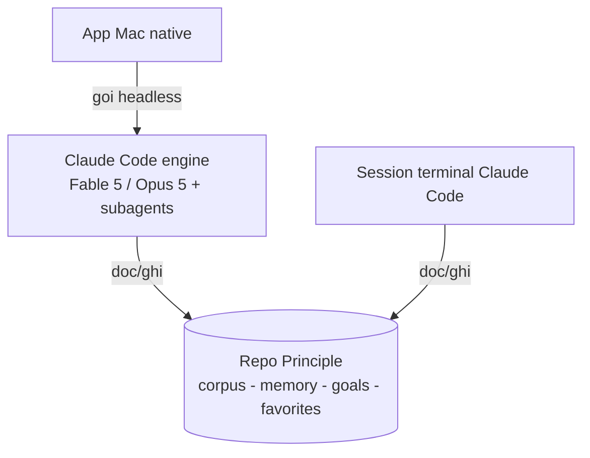
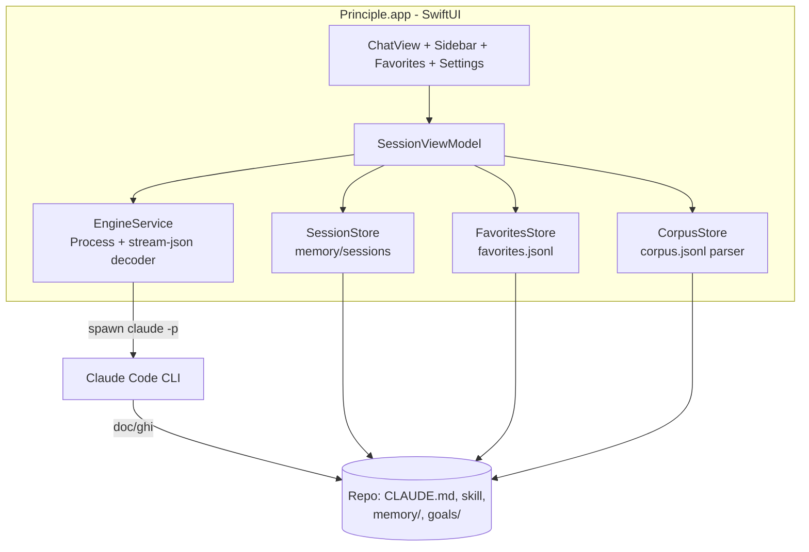
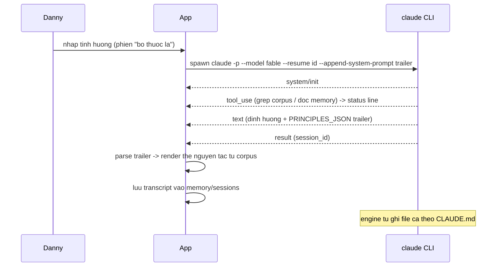

# Principle Mac App - Plan

## Goal Capsule

- **Objective:** Build app Mac native "Principle" — chat mentor Ray theo phiên sạch, thẻ nguyên tắc tiếng Việt + yêu thích, engine là Claude Code headless chạy trên subscription, bộ nhớ là chính repo này.
- **Product authority:** Product Contract bên dưới (R1–R8, KD1–KD5). Thay đổi scope sản phẩm phải hỏi Danny; chi tiết kỹ thuật trong phạm vi KTD do executor quyết.
- **Execution profile:** Swift 6.3 / Xcode 26.6 có sẵn trên máy build (đã xác minh). Mọi lời gọi engine trong test dùng model `haiku` và fixture repo — không đụng memory cá nhân, không đốt Fable.
- **Stop conditions:** dừng và báo nếu (a) một KD session-settled bị bằng chứng vô hiệu, (b) engine headless không đáp ứng được một R nào đó ngoài cách đã xác minh, (c) cần ghi/xóa dữ liệu trong `memory/` thật.
- **Tail ownership:** pipeline gọi (lfg) sở hữu commit/PR/CI; ce-work trả kết quả về caller, không tự ship.

---

## Product Contract

### Summary

Build một app Mac native — bản "Principles in Action tiếng Việt" cá nhân: mở từ Dock là chat được với mentor Ray, mỗi chủ đề/ngày một phiên riêng không lẫn, lời khuyên kèm nguyên văn nguyên tắc từ bản dịch và lưu yêu thích được. App gọi Claude Code headless vào repo Principle nên dùng chung trí nhớ với session terminal và không tốn thêm chi phí ngoài subscription.

### Problem Frame

Đường hỏi Ray hiện tại là Claude Desktop: các đoạn chat nằm lẫn với mọi chat khác, không tách theo chủ đề hay ngày, nên theo dõi một ca qua nhiều lần hỏi gần như không làm được. Desktop cũng không đọc/ghi được các file memory và goals trong repo — giao thức trí nhớ đã dựng chỉ chạy khi mở Claude Code vào repo, một con đường không hợp cho việc "ngồi xuống hỏi mentor".

App Principles in Action của Dalio giải quyết đúng trải nghiệm này nhưng bằng tiếng Anh — trở ngại thật với người hỏi, trong khi tài sản độc nhất của repo là corpus 515 nguyên tắc bản dịch tiếng Việt đã tra cứu được bằng máy.

### Key Decisions

- KD1. **Engine là Claude Code headless chạy trên Claude subscription** (session-settled: user-directed — chọn thay vì Anthropic API key: không tốn thêm tiền, có sẵn Fable 5/Opus 5 + spawn subagent + skill ask-ray). Governs R4, R5.
- KD2. **Mac-only ở giai đoạn này** (session-settled: user-directed — chọn thay vì làm cả iPhone: nơi dùng chính là bàn làm việc; chấp nhận rằng lên iPhone sau này phải làm lại phần lõi vì engine subscription chỉ sống trên Mac).
- KD3. **Repo Principle là bộ nhớ duy nhất** (session-settled: user-approved — app đọc/ghi thẳng corpus, memory, goals, favorites trong repo thay vì tự chế storage; local-first, dời repo thì app mất trí nhớ — đã chấp nhận). Governs R3, R7.
- KD4. **MVP là "chat sạch"; vòng lặp Journal để giai đoạn sau** (session-settled: user-directed — khi ép về bản nhỏ nhất, giá trị lõi được chốt là chat theo phiên không lẫn; đúng trình tự 3 giai đoạn trong apps/decision-journal/CONCEPT.md).
- KD5. **Tiếng Việt là mặc định toàn app** — lời khuyên, thẻ nguyên tắc, UI. Đây là lý do tồn tại của app so với Principles in Action.

### Requirements

**Phiên chat (lõi)**

- R1. Mỗi cuộc tư vấn là một phiên riêng có tên theo chủ đề; sidebar liệt kê phiên nhóm theo ngày, mở lại được, không lẫn giữa các chủ đề.
- R2. Phản hồi đi theo khung ask-ray 4 bước (chẩn đoán ca → tra corpus → áp vào ca → chốt hướng đi); chỉ trích nguyên tắc grep được từ corpus, không có thì nói thẳng.
- R3. Phiên mới nạp memory và goals trước khi chẩn đoán; tư vấn xong sinh file ca theo `memory/cases/_TEMPLATE.md` và cập nhật index — đúng giao thức trong `CLAUDE.md`.
- R4. Model trả lời mặc định là Fable 5, đổi được trong Settings (Fable 5 / Opus 5); tra cứu corpus và các việc cơ học chạy bằng subagent sonnet/haiku.
- R5. Mở app là dùng được — không dev server, không terminal; khi engine chưa sẵn sàng (Claude Code chưa cài / chưa đăng nhập), app hiện trạng thái và cách khắc phục thay vì treo.
- R6. Trong lúc engine xử lý (chẩn đoán, tra corpus có thể mất hàng phút), app hiển thị đang ở bước nào.

**Đọc sách và yêu thích**

- R7. Thẻ nguyên tắc trong chat hiện nguyên văn tiếng Việt; bấm ♥ lưu vào danh sách yêu thích xem lại được ngoài chat; favorites lưu dạng file trong repo để session terminal cũng đọc được.
- R8. Từ một thẻ hoặc một mục yêu thích, mở ra được ngữ cảnh chương của nguyên tắc đó (các nguyên tắc lân cận cùng chương).

### Key Flows

- F1. Hỏi ca mới
  - **Trigger:** Mở app, tạo phiên mới với một chủ đề.
  - **Steps:** Nhập tình huống → app hiện tiến trình (nạp memory, chẩn đoán, tra corpus) → trả về đoạn định hướng + thẻ nguyên tắc → file ca được ghi, index cập nhật.
  - **Outcome:** Phiên nằm trong sidebar theo ngày/chủ đề. **Covers R1, R2, R3, R6.**
- F2. Tiếp nối ca cũ
  - **Trigger:** Mở lại phiên cũ từ sidebar.
  - **Steps:** Ngữ cảnh ca (file ca + hội thoại) được nạp lại → hỏi tiếp, mentor tiếp nối thay vì chẩn đoán lại từ đầu.
  - **Covers R1, R3.**
- F3. Lưu và đọc lại yêu thích
  - **Steps:** Bấm ♥ trên thẻ → mở tab Favorites → đọc nguyên văn, mở ngữ cảnh chương. **Covers R7, R8.**
- F4. Engine không sẵn sàng
  - **Trigger:** Mở app khi Claude Code chưa đăng nhập.
  - **Outcome:** Màn hình trạng thái với hướng dẫn khắc phục, không màn hình trắng. **Covers R5.**

### Acceptance Examples

- AE1. **Covers R3.** Given ca "bỏ thuốc lá" đã có file trong `memory/cases/`, When mở phiên mới hỏi tiếp về chuyện thuốc lá, Then mentor nhận ra đây là tập tiếp theo của ca cũ và tiếp nối thay vì chẩn đoán lại từ đầu.
- AE2. **Covers R2.** When vấn đề không có nguyên tắc nào trong corpus phủ, Then app nói thẳng là không có và trả lời bằng lập luận thường — không gán ép, không bịa.
- AE3. **Covers R7.** Given nguyên tắc có `has_body: false`, When thẻ hiển thị, Then chỉ hiện tiêu đề — không sinh thân bài để lấp chỗ trống.
- AE4. **Covers R4.** Given Settings đang chọn Opus 5, When hỏi ca mới, Then phản hồi chạy Opus 5 và app hiển thị model đang dùng cho phiên đó.
- AE5. **Covers R5.** Given Claude Code bị đăng xuất, When mở app và gửi câu hỏi, Then thấy thông báo trạng thái kèm hướng dẫn đăng nhập.

### Success Criteria

- Sau 2 tuần dùng thật, mọi ca hỏi Ray đi qua app — không còn quay về Claude Desktop.
- `memory/cases/` tích lũy tự động theo từng phiên, không phải chép tay.
- Đọc lời khuyên và nguyên tắc thoải mái hoàn toàn bằng tiếng Việt — trở ngại tiếng Anh của Principles in Action biến mất.

### Scope Boundaries

**Deferred for later**

- iPhone/iPad — cần chuyển engine sang API/backend, làm lại phần lõi; chỉ xét khi app Mac đã chứng minh giá trị.
- Vòng lặp Journal (tự sinh entry quyết định, nhắc chấm kết quả sau 30 ngày, promote tiêu chí thành nguyên tắc) — giai đoạn 2 theo `apps/decision-journal/CONCEPT.md`; 6 lỗi đã biết của prototype chỉ cần sửa khi phần này vào scope.
- Tự đề xuất tên phiên từ chẩn đoán kiểu ca — MVP để người dùng gõ chủ đề.

**Outside this product's identity**

- Multi-user, chia sẻ, publish — app cá nhân của một người dùng.
- App đọc sách trọn vẹn — corpus đã bỏ phần hồi ký (~40% sách) có chủ đích; app đọc nguyên tắc, không phải ebook reader.

### Dependencies / Assumptions

- Claude Code cài sẵn và đăng nhập subscription trên máy (hiện có, bản 2.1.233). Đã xác minh bằng spike 2026-08-15: chạy headless (`claude -p`) dưới subscription auth đọc được corpus qua tool, spawn được subagent, nạp skill ask-ray, và hỗ trợ `--output-format stream-json` để stream tiến trình về app.
- Corpus 515 nguyên tắc tiếng Việt tại `.claude/skills/ask-ray/references/corpus.jsonl` (hiện có); bản dịch có bản quyền — mọi dữ liệu ở lại máy, app không gửi corpus đi đâu ngoài lời gọi model.
- Repo nằm ở vị trí cố định; app trỏ vào repo — dời repo phải cập nhật đường dẫn (đã chấp nhận ở KD3).
- App và session terminal có thể cùng ghi bộ nhớ; cách ghi mỗi-ca-một-file và favorites append-only giữ hai bên không giẫm nhau (xem KTD6).

### Sources / Research

- `.claude/skills/ask-ray/SKILL.md` — khung tư vấn 4 bước app phải giữ nguyên.
- `CLAUDE.md` — giao thức memory/goals là hợp đồng chung giữa app và session terminal.
- `apps/decision-journal/CONCEPT.md` — trình tự 3 giai đoạn và chỗ nối Journal khi vào giai đoạn 2.
- `.claude/skills/ask-ray/references/artifact-spec.md` — spec thẻ nguyên tắc hiện tại, tham chiếu khi thiết kế thẻ native (kể cả bài học typography tiếng Việt).
- Probe engine 2026-08-15 (chạy thật trên máy): `--resume <session_id>` giữ ngữ cảnh đa lượt (test nhớ số 47 pass); schema stream-json ghi ở KTD1; alias `--model fable|opus|haiku` hợp lệ theo help; `claude auth status` trả JSON `{loggedIn, subscriptionType}` không tốn model call.

---

## Planning Contract

**Product Contract preservation:** Product Contract unchanged (R1–R8, KD1–KD5, F/AE giữ nguyên từ bản requirements-only).

### Key Technical Decisions

- KTD1. **Engine adapter spawn CLI `claude` qua `Foundation.Process`**, cwd = repo root, lệnh dạng `claude -p --model <alias> --output-format stream-json --verbose --permission-mode acceptEdits --allowedTools "Read Grep Glob Task Write Edit Bash(grep:*) Bash(python3:*)"`; lượt tiếp theo thêm `--resume <session_id>`. Bash ngoài danh sách trên bị từ chối dưới `acceptEdits` ở print mode — allowlist này phủ đúng recipe tra corpus trong CLAUDE.md/skill. (Kế thừa KD1 session-settled; chọn CLI thay vì nhúng Agent SDK/Node: không thêm runtime, mọi cơ chế đã probe chạy thật.) Governs R4, R5. Sự kiện phải decode (đã capture mẫu): `system/init` (manifest, có `skills`), `assistant` với content `thinking` / `tool_use {name, input.description}` / `text`, `user` với `tool_result`, `system/thinking_tokens`, và `result` (terminal, mang `session_id`, `is_error`, `result`). Trường `parent_tool_use_id` khác null nghĩa là đang trong subagent. Watchdog: stream im lặng quá 5 phút (không event mới) → coi như treo, terminate process, phiên hiện lỗi cho gửi lại.
- KTD2. **Phiên lưu tại `memory/sessions/<uuid>.json`**: topic, ngày tạo, model, `claude_session_id`, transcript đã render. App là chủ sở hữu transcript để vẽ UI; engine giữ ngữ cảnh model qua `--resume`. Ngữ cảnh engine sống ở `~/.claude` ngoài repo và có thể mất (xóa `~/.claude`, CLI prune, dời repo): khi spawn `--resume` fail hoặc `result.is_error` báo session không tồn tại, EngineService bỏ id cũ và thử lại một lần như phiên mới, seed bằng transcript app sở hữu + file ca của phiên. (Kế thừa KD3, governs R1, R3.)
- KTD3. **Cầu thẻ nguyên tắc = trailer máy-đọc-được theo `id` corpus**: `--append-system-prompt` yêu cầu cuối mỗi câu trả lời in đúng một dòng `PRINCIPLES_JSON: {"ids":["life:5.6","life:1.8"]}` — dùng `id` (unique) chứ không dùng `num`, vì corpus có 515 record nhưng chỉ ~414 `num` riêng biệt ("2.1" trúng cả Nguyên tắc sống lẫn làm việc). Prompt này đồng thời override Bước 4 của skill ask-ray: bỏ hẳn artifact, chỉ trả text định hướng + trailer — artifact vừa không render native được vừa đẩy nội dung ca + nguyên văn bản dịch ra ngoài máy, trái giả định dữ-liệu-ở-lại-máy. App parse trailer, ẩn khỏi UI, tra `corpus.jsonl` local theo `id` để render thẻ nguyên văn. Governs R7. Không có trailer → không thẻ, chat vẫn hiển thị bình thường.
- KTD4. **Phát hiện engine bằng `claude --version` + `claude auth status`** (JSON `loggedIn`) lúc mở app và trước mỗi lần gửi — miễn phí, không gọi model. App mở từ Dock KHÔNG có PATH của shell: EngineService resolve binary theo danh sách ứng viên (`~/.local/bin/claude`, `/opt/homebrew/bin/claude`, `/usr/local/bin/claude`, `/usr/bin/claude`) + trường "đường dẫn Claude Code" override được trong Settings, và spawn bằng `executableURL` tuyệt đối, không tra PATH kế thừa. Governs R5.
- KTD5. **App là Swift Package tại `apps/mac/`** với hai target: library `PrincipleCore` (Engine, Store, Corpus, Model, SessionViewModel, AppSettings — nơi `PrincipleTests` trỏ vào) và executable `Principle` mỏng (chỉ `@main` + views). `Package.swift` khai báo tường minh `platforms: [.macOS(.v14)]` — thiếu là toolchain mặc định macOS 26. `make-app.sh` đóng bundle `Principle.app` vào `~/Applications`, sinh Info.plist với `CFBundleIdentifier` cố định `com.danny.principle`, `CFBundleName`, `LSMinimumSystemVersion 14.0`; AppSettings dùng `UserDefaults(suiteName: "com.danny.principle")` để bản `swift run` và bản bundle chung một domain; khi chạy dev, set `NSApplication.setActivationPolicy(.regular)` để cửa sổ nổi lên như app thật. Chọn SPM thay vì `.xcodeproj`: diff được, build/test headless, không file project nhị phân khó review. Executor có thể đổi sang XcodeGen nếu SPM vướng resource — miễn giữ build headless được.
- KTD6. **Favorites tại `memory/favorites.jsonl`**, append-only, mỗi dòng `{"id":"life:5.6","saved_at":"ISO8601"}` (key theo `id` corpus, đồng bộ với KTD3); bỏ thích = dòng `{"id":...,"removed":true,...}`. Append-only để app và session terminal không giẫm nhau khi cùng ghi. (Kế thừa KD3, governs R7.)
- KTD7. **Progress UI map từ stream events**: `tool_use` → dòng trạng thái từ `input.description`; `parent_tool_use_id != null` → "đang tra cứu (subagent)…"; `thinking_tokens` → "đang suy nghĩ…". Governs R6.
- KTD8. **App không quản lý subagent tiering** — Settings chỉ map model trả lời (Fable 5 → alias `fable`, Opus 5 → `opus`); việc spawn sonnet/haiku cho tra cứu thuộc về skill ask-ray + CLAUDE.md của repo, app truyền nguyên. Governs R4.

### High-Level Technical Design

Một lượt tư vấn (định hướng, không phải spec):

### Assumptions

- Đặt tên phiên: người dùng gõ chủ đề khi tạo phiên (auto-suggest đã đưa vào Deferred).
- Target macOS 14+; máy build có Xcode 26.6 / Swift 6.3 (đã xác minh).
- Engine đứt giữa chừng (process chết, mất mạng): app hiện trạng thái lỗi trên phiên đó và cho gửi lại; không tự retry ngầm.
- Test/e2e chạy trên **fixture repo** (bản sao tối giản: CLAUDE.md + skill + corpus mẫu vài dòng + memory rỗng) trong thư mục tạm — không bao giờ ghi vào memory thật của repo; mọi lời gọi engine trong test dùng `--model haiku`.
- Repo chưa có CI; verification chạy local (`swift build/test` + e2e smoke).

### Risks

- **TCC/Documents:** repo nằm trong `~/Documents` (được TCC bảo vệ) — bản bundle `Principle.app` lần đầu đọc repo sẽ cần user cấp quyền; `swift run` từ Terminal không tái hiện được vì thừa hưởng grant của Terminal. Nghiệm thu Dock-launch (DoD) phải đi qua hộp thoại này một lần.
- **Hai bản cài `claude`:** máy có cả `~/.local/bin/claude` và `/opt/homebrew/bin/claude` — danh sách ứng viên KTD4 ưu tiên `~/.local/bin` (bản đã spike); nếu hai bản lệch version gây khác biệt, đặt override trong Settings.
- **Session data không có backup:** `memory/` gitignored nên phiên/favorites chỉ sống trên máy này — đã chấp nhận theo KD3; nếu sau này cần backup thì là việc ngoài scope.

---

## Implementation Units

Thứ tự phụ thuộc: U1 → (U2, U3) → U4 → (U5 → U6 song song U7); U8 cuối. (U3 chỉ cần U1; U7 chỉ cần U2 — khớp trường Dependencies từng unit.)

### U1. Scaffold Swift package cho app

- **Goal:** Khung app chạy được: cửa sổ SwiftUI có sidebar/detail và switch cấp-app Chat/Favorites, build headless.
- **Requirements:** R5 (nền tảng). Cites KTD5.
- **Dependencies:** —
- **Files:** `apps/mac/Package.swift`, `apps/mac/Sources/Principle/PrincipleApp.swift`, `apps/mac/Sources/PrincipleCore/` (đặt nền hai target theo KTD5), `apps/mac/Sources/Principle/ContentView.swift`, `apps/mac/scripts/make-app.sh`, `apps/mac/Tests/PrincipleTests/SmokeTests.swift`
- **Approach:** Hai target theo KTD5; `@main App`, `NavigationSplitView` với toolbar picker Chat/Favorites ở cấp app (mô hình điều hướng cho U6 bám vào); script bundle `.app` + Info.plist theo KTD5.
- **Test scenarios:**
  - `swift build` và `swift test` pass trên máy sạch chỉ có Xcode.
  - `make-app.sh` sinh `Principle.app` mở được (smoke tay ở U8).
- **Verification:** build + test xanh; `swift run` mở cửa sổ.

### U2. EngineService — spawn và decode stream

- **Goal:** Lớp engine: spawn `claude -p` đúng KTD1, decode stream-json thành event Swift, hỗ trợ resume và cancel, phát hiện engine theo KTD4.
- **Requirements:** R4, R5, R6. Cites KTD1, KTD4.
- **Dependencies:** U1
- **Files:** `apps/mac/Sources/Principle/Engine/EngineService.swift`, `apps/mac/Sources/Principle/Engine/StreamEvent.swift`, `apps/mac/Sources/Principle/Engine/EngineAvailability.swift`, `apps/mac/Tests/PrincipleTests/StreamEventDecodingTests.swift`, `apps/mac/Tests/PrincipleTests/Fixtures/stream-sample.jsonl`
- **Approach:**
  1. `StreamEvent` decode các loại event ở KTD1 từ fixture dòng thật (lấy từ probe).
  2. `EngineService.send(prompt:model:resumeID:cwd:)` → `AsyncThrowingStream<StreamEvent>`; kill process khi cancel.
  3. `EngineAvailability.check()` resolve binary theo danh sách ứng viên + override KTD4, rồi chạy `--version` + `auth status`, parse JSON.
- **Execution note:** Viết decoder test-first trên fixture; không gọi engine thật trong unit test.
- **Test scenarios:**
  - Resolve binary: override có giá trị → dùng override; không có → ứng viên đầu tiên tồn tại thắng; không ứng viên nào tồn tại → `.notInstalled`. (PATH kế thừa không được dùng — giả lập bằng env rỗng.)
  - Watchdog KTD1: stream không event mới quá ngưỡng (rút ngắn trong test) → process bị terminate, stream kết thúc bằng error "engine treo".
  - Decode đủ loại event từ fixture: init, thinking, tool_use, tool_result, text, thinking_tokens, result (đúng `session_id`).
  - Dòng JSON lạ/không quen → bỏ qua an toàn, không crash.
  - `result.is_error == true` → stream kết thúc bằng error có message.
  - Cancel giữa chừng → process bị terminate (kiểm bằng process giả `/bin/cat`).
  - Covers AE5. `auth status` trả `loggedIn:false` (fixture) → availability = `.loggedOut` kèm hướng dẫn.
  - Binary không tồn tại ở path cấu hình → `.notInstalled`.
- **Verification:** unit tests xanh, không network/model call.

### U3. SessionStore — phiên và transcript

- **Goal:** Tạo/lưu/mở phiên theo KTD2; nhóm theo ngày cho sidebar.
- **Requirements:** R1, R3. Cites KTD2.
- **Dependencies:** U1
- **Files:** `apps/mac/Sources/Principle/Store/SessionStore.swift`, `apps/mac/Sources/Principle/Model/ChatSession.swift`, `apps/mac/Tests/PrincipleTests/SessionStoreTests.swift`
- **Approach:** JSON mỗi phiên một file trong `memory/sessions/` của repo path cấu hình; load tất cả lúc mở, sort/nhóm theo ngày; append message + cập nhật `claude_session_id` sau mỗi lượt.
- **Test scenarios:**
  - Tạo phiên mới với topic → file xuất hiện đúng thư mục (temp dir), round-trip đọc lại đủ trường.
  - Hai phiên cùng ngày, một phiên hôm trước → nhóm sidebar đúng 2 ngày, thứ tự mới trước.
  - File phiên hỏng (JSON lỗi) → bỏ qua có log, không crash, các phiên khác vẫn load. Covers R1.
  - Covers F2/AE1 (mức store): mở phiên có `claude_session_id` → giá trị được trả cho EngineService làm `resumeID`.
  - Resume id mồ côi (engine báo không tồn tại, per KTD2) → store xóa id cũ, phiên vẫn mở được và lượt kế tiếp chạy như phiên mới có seed transcript.
- **Verification:** unit tests xanh trên temp dir.

### U4. Chat UI — sidebar, phiên, streaming, trạng thái

- **Goal:** Trải nghiệm lõi "chat sạch": sidebar phiên theo ngày/chủ đề, khung chat stream chữ, dòng trạng thái tiến trình, màn hình lỗi engine.
- **Requirements:** R1, R5, R6. Cites KTD1, KTD4, KTD7. KD5: toàn bộ string tiếng Việt.
- **Dependencies:** U2, U3
- **Files:** `apps/mac/Sources/Principle/UI/SidebarView.swift`, `apps/mac/Sources/Principle/UI/ChatView.swift`, `apps/mac/Sources/Principle/UI/NewSessionSheet.swift`, `apps/mac/Sources/Principle/UI/EngineStatusView.swift`, `apps/mac/Sources/Principle/SessionViewModel.swift`, `apps/mac/Tests/PrincipleTests/SessionViewModelTests.swift`
- **Approach:** ViewModel nhận `AsyncStream<StreamEvent>` từ EngineService (inject mock trong test), map event → trạng thái UI theo KTD7; typography theo `.claude/skills/ask-ray/references/artifact-spec.md` (line-height thoáng cho tiếng Việt, không webfont).
- **Test scenarios (ViewModel, engine mock):**
  - Chuỗi event init→tool_use→text→result → trạng thái đi đúng: đang chuẩn bị → đang chạy tool (đúng description) → đang trả lời → xong.
  - `parent_tool_use_id != null` → trạng thái "đang tra cứu (subagent)…". Covers R6.
  - Event error → phiên hiện lỗi, nút gửi lại khả dụng.
  - Availability `.loggedOut` trước khi gửi → chặn gửi, hiện EngineStatusView. Covers AE5.
  - Nút Dừng chỉ enable khi đang stream; bấm → gọi cancel của EngineService (U2), phiên về trạng thái nghỉ, transcript giữ phần đã nhận.
  - NewSessionSheet: nút Tạo disable khi chủ đề rỗng hoặc toàn khoảng trắng. Covers R1.
- **Verification:** unit tests xanh; `swift run` thao tác tay: tạo phiên, thấy trạng thái chạy (check thật ở U8).

### U5. Thẻ nguyên tắc — trailer, corpus, render

- **Goal:** Parse trailer `PRINCIPLES_JSON` theo KTD3, tra corpus local, render thẻ nguyên văn trong chat.
- **Requirements:** R2, R7. Cites KTD3. KD5.
- **Dependencies:** U4
- **Files:** `apps/mac/Sources/Principle/Corpus/CorpusStore.swift`, `apps/mac/Sources/Principle/Corpus/TrailerParser.swift`, `apps/mac/Sources/Principle/UI/PrincipleCardView.swift`, `apps/mac/Tests/PrincipleTests/CorpusStoreTests.swift`, `apps/mac/Tests/PrincipleTests/TrailerParserTests.swift`, `apps/mac/Tests/PrincipleTests/Fixtures/corpus-sample.jsonl`
- **Approach:** CorpusStore đọc `corpus.jsonl` (path từ Settings/repo), index chính theo `id` (unique), index phụ theo `num` chỉ để tra cứu tay; TrailerParser tách dòng trailer khỏi text hiển thị; system prompt trailer đặt hằng số một chỗ trong EngineService (cite KTD3).
- **Test scenarios:**
  - Corpus sample: tra id `"life:5.6"` ra đúng title/body; id không tồn tại → không thẻ, không crash.
  - Covers AE3. Mục `has_body:false` → thẻ chỉ title, không hiện body rỗng/bịa.
  - Trailer hợp lệ giữa text → text sạch (không lộ trailer) + đúng danh sách id, giữ thứ tự.
  - Không có trailer / trailer JSON hỏng → không thẻ, text nguyên vẹn. Covers AE2 (mức app: không tự chế thẻ khi engine không cite).
  - `num` trùng giữa hai phần sách (vd "2.1" có ở cả Nguyên tắc sống lẫn làm việc) → hai `id` khác nhau, hai thẻ phân biệt đúng phần/chương, không lẫn.
- **Verification:** unit tests xanh.

### U6. Favorites — lưu, xem, ngữ cảnh chương

- **Goal:** ♥ trên thẻ ghi `memory/favorites.jsonl` theo KTD6; tab Favorites đọc lại; mở ngữ cảnh chương từ thẻ/favorite.
- **Requirements:** R7, R8. Cites KTD6.
- **Dependencies:** U5
- **Files:** `apps/mac/Sources/Principle/Store/FavoritesStore.swift`, `apps/mac/Sources/Principle/UI/FavoritesView.swift`, `apps/mac/Sources/Principle/UI/ChapterContextView.swift`, `apps/mac/Tests/PrincipleTests/FavoritesStoreTests.swift`
- **Approach:** Append-only JSONL key theo `id` (KTD6); trạng thái hiện tại = replay các dòng (dòng `removed` sau cùng thắng); FavoritesView sống sau switch Chat/Favorites cấp app (U1); ChapterContextView present dạng sheet từ cả PrincipleCardView lẫn FavoritesView, lọc corpus theo trường `chapter` của record đang xem (không lọc theo prefix `num`).
- **Test scenarios:**
  - Thích → dòng append đúng schema (id); bỏ thích → dòng removed; replay ra trạng thái đúng. Covers R7.
  - File có dòng hỏng xen giữa → bỏ qua dòng đó, còn lại vẫn replay đúng.
  - Ngữ cảnh chương của `life:5.6` → liệt kê các nguyên tắc cùng `chapter` theo thứ tự. Covers R8.
  - Record có `chapter` rỗng (corpus có ~10 mục vậy) → sheet ngữ cảnh hiện trạng thái "không có ngữ cảnh chương", không crash.
  - Chưa có favorite nào → FavoritesView hiện empty state chỉ về chat + nút ♥, không phải khung trắng.
- **Verification:** unit tests xanh.

### U7. Settings — model, repo path, trạng thái engine

- **Goal:** Settings chọn model (Fable 5 mặc định / Opus 5), repo path, đường dẫn binary Claude Code, và hiển thị trạng thái engine.
- **Requirements:** R4, R5. Cites KTD4, KTD5, KTD8.
- **Dependencies:** U2
- **Files:** `apps/mac/Sources/Principle/UI/SettingsView.swift`, `apps/mac/Sources/PrincipleCore/AppSettings.swift`, `apps/mac/Tests/PrincipleTests/AppSettingsTests.swift`
- **Approach:** `UserDefaults(suiteName: "com.danny.principle")` theo KTD5; map hiển thị→alias đúng KTD8; đổi model áp dụng cho lượt gửi kế tiếp; header chat hiện model của phiên (phục vụ AE4); trường binary path mặc định rỗng = dùng danh sách ứng viên KTD4.
- **Test scenarios:**
  - Mặc định là Fable 5 (alias `fable`); chọn Opus 5 → lượt gửi mới mang alias `opus`. Covers AE4 (mức unit: đúng alias vào lệnh spawn).
  - Repo path đổi → store/corpus trỏ path mới; path không tồn tại → cảnh báo, không crash.
  - Binary path override đặt giá trị → EngineService spawn đúng `executableURL` đó thay vì danh sách ứng viên. Covers R5.
- **Verification:** unit tests xanh.

### U8. E2e smoke và wiring giao thức tư vấn

- **Goal:** Chứng minh vòng đầy-đủ chạy thật: app gửi câu hỏi qua engine thật (haiku, fixture repo cách ly), stream về, thẻ render, file ca xuất hiện; đồng thời wire phần tra cứu bằng subagent rẻ vào skill.
- **Requirements:** R2, R3, R4, R6. Cites KTD1, KTD2, KTD3, KTD8. Covers F1.
- **Dependencies:** U4, U5, U6, U7
- **Files:** `apps/mac/Tests/E2E/e2e-smoke.sh`, `apps/mac/Tests/E2E/fixture-repo/` (template: CLAUDE.md rút gọn + skill ask-ray copy + `references/corpus.jsonl` **tự chế vài dòng nguyên tắc giả** — không trích bản dịch thật vì fixture được commit còn corpus thật gitignored vì bản quyền + `memory/MEMORY.md` rỗng + `memory/cases/_TEMPLATE.md` + `goals/GOALS.md` rỗng), `apps/mac/Sources/PrincipleCore/Engine/ConsultPrompt.swift`, `.claude/skills/ask-ray/SKILL.md` (wiring tra cứu subagent)
- **Approach:**
  1. ConsultPrompt: dựng prompt lượt đầu mời `/ask-ray` với chủ đề + tình huống; lượt sau chỉ nội dung; kèm system-prompt trailer + override bỏ artifact theo KTD3.
  2. Wiring R4: thêm vào Bước 2 của `.claude/skills/ask-ray/SKILL.md` chỉ dẫn — khi có Agent tool, delegate grep/tra corpus cho subagent `haiku`/`sonnet`; không có Agent tool thì chạy inline như hiện tại (nhánh sẵn có của skill).
  3. Script e2e: copy fixture template vào `$(mktemp -d)` NGOÀI cây repo (cwd trong repo sẽ nạp CLAUDE.md thật của repo cha — vi phạm cách ly), spawn engine vào đó với `--model haiku --disallowedTools Task`; assert: stream có tool_use, có text, result không error, KHÔNG có tool call artifact/publish nào, trailer parse được HOẶC ghi nhận không có trailer (in cảnh báo), `memory/cases/` của fixture temp có file mới, và `memory/` của repo thật không đổi (diff trước/sau).
  4. Chạy tay một lần `swift run` với repo thật + Fable cho một ca thật — bước nghiệm thu cuối, không nằm trong test tự động.
- **Execution note:** E2e chỉ tốn một lời gọi haiku vì `--disallowedTools Task` chặn nhánh delegate-lên-Fable của skill (không chặn thì skill sẽ spawn Fable subagent, đốt tiền); gate sau unit tests, chạy một lần khi hoàn tất, không chạy trong vòng lặp dev.
- **Test scenarios:**
  - E2e smoke pass trên fixture temp như mô tả (một lần gọi haiku, không call Fable, không artifact).
  - Covers AE1 (smoke): lượt hai với `--resume` trên phiên fixture giữ được ngữ cảnh (hỏi lại chi tiết từ lượt một).
- **Verification:** `e2e-smoke.sh` exit 0 và xác nhận `memory/` thật untouched; kiểm tay app chạy thật với Fable một ca — điều kiện Definition of Done.

---

## Verification Contract

| Gate | Lệnh | Áp dụng |
|---|---|---|
| Build | `cd apps/mac && swift build` | mọi unit |
| Unit tests | `cd apps/mac && swift test` | mọi unit (U1–U7 không gọi engine thật) |
| E2e smoke | `apps/mac/Tests/E2E/e2e-smoke.sh` | U8; một lời gọi haiku, fixture repo, không đụng memory thật |
| Runtime check | `cd apps/mac && swift run` — tạo phiên, gửi ca thật với Fable, thấy trạng thái + thẻ + file ca | nghiệm thu cuối trước khi báo xong |

Quality gates: không warning mới ở `swift build`; test không được ghi ra ngoài temp dir/fixture; không hardcode đường dẫn tuyệt đối trong code (repo path chỉ từ Settings, default suy từ vị trí ứng dụng chạy dev).

## Definition of Done

- U1–U8 hoàn thành, build + unit tests + e2e smoke xanh tại HEAD.
- Mở `Principle.app` từ Finder/Dock (không phải từ terminal): engine được phát hiện đúng dù không có PATH của shell, và đi qua hộp thoại quyền Documents thành công.
- Chạy thật một lượt tư vấn end-to-end (app → Fable 5 → thẻ nguyên tắc → file ca trong fixture hoặc repo thật) và ghi lại bằng chứng (output/screenshot) trong PR.
- Mọi AE1–AE5 có test hoặc bước nghiệm thu tương ứng pass.
- Không còn code thử nghiệm/dead code từ các hướng đã bỏ trong diff.
- `README.md` thêm mục ngắn: build/chạy app (`swift run`, `make-app.sh`).
- Dữ liệu cá nhân an toàn: diff không chứa nội dung `memory/` thật hay corpus đầy đủ trong fixture (fixture chỉ vài dòng corpus mẫu).
